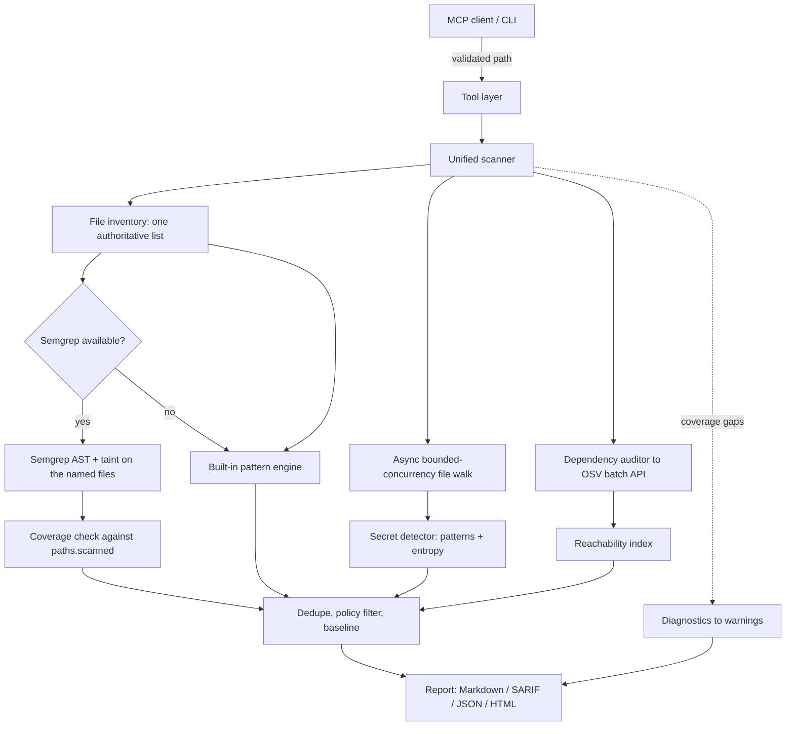

# Sentinel MCP

A local-first Model Context Protocol server that gives AI assistants real security tooling. It combines Semgrep-based static analysis, regex and entropy secret detection, OSV-backed dependency auditing, and Infrastructure-as-Code checks behind one scanning pipeline, usable from Claude, Cursor, any MCP client, or the CLI.

## Design principles

- **Deterministic.** The same commit produces the same findings. Rule packs are versioned in this repository and nothing is downloaded mid-scan unless you opt in.
- **Explicit about coverage.** Every scan reports what it could not read. A file that failed to open is a coverage gap, never a silent pass.
- **Local by default.** Source code never leaves the machine. The only optional network call is an OSV advisory lookup by package name and version, and `offline` mode removes even that.
- **Secrets stay secret.** Detected credentials are redacted everywhere they are reported: Markdown, SARIF, MCP responses, and logs.

## Features

### Static analysis

Detects SQL injection, XSS, path traversal, command injection, weak cryptography, and more. Both engines run over every file: Semgrep contributes AST-level and cross-file taint analysis, and the built-in pattern registry contributes rules Semgrep's packs do not express. Overlapping reports of one issue are collapsed, keeping the Semgrep copy. Semgrep is installed automatically when it is missing; if it cannot be installed, the scan reports itself incomplete and exits non-zero rather than passing on pattern-only coverage.

Semgrep targets are named explicitly rather than pointing it at a directory, because it applies its own ignore list (which excludes `test/` and `tests/`) when it picks targets itself. Every scan reports how many files each engine analysed, taken from Semgrep's own output rather than from what it was asked to scan.

### Secret detection

Provider-specific patterns for AWS, GitHub, Stripe, Slack, GCP, private keys, and database URLs, plus Shannon-entropy analysis for unknown formats. Lockfile integrity digests, git SHAs, UUIDs, and documentation placeholders are suppressed to keep the signal usable.

### Supply chain scanning

Parses `package.json`, `package-lock.json`, `yarn.lock`, `pnpm-lock.yaml`, `requirements.txt`, `poetry.lock`, `pyproject.toml`, `Pipfile.lock`, `go.mod`, `Cargo.lock`, `pom.xml`, `Gemfile.lock`, and `composer.lock`, then queries the OSV database in batches with timeouts and retry. Reachability analysis flags whether a vulnerable package is actually imported.

### Infrastructure as Code and AI/LLM rules

Dockerfiles, Terraform, Kubernetes manifests, and GitHub Actions workflows are checked for misconfiguration. A dedicated rule pack covers OWASP LLM Top 10 concerns: prompt injection, excessive agency, system-prompt leakage, and hallucinated package imports.

### Git history secret scanning

Scans commit history for credentials that were committed and later removed. They remain recoverable from the repository and still need rotating. Every git call uses an argument array with no shell.

### Baseline mode and CI enforcement

`.sentinel-baseline.json` records existing findings by fingerprint, so future scans report only what is new. Distinct exit codes let CI tell a failed scan apart from a clean one.

Adopting a scanner on an existing project otherwise means a red build on day one. Record what is already there, commit the file, and let CI fail only on what gets added after:

```bash
node dist/index.js --scan . --write-baseline
git add .sentinel-baseline.json
```

`--write-baseline` records every current finding and exits 0, because accepting known findings is an administrative step rather than a gate. It always records the complete current set, so re-running it after fixing or adding code refreshes the baseline rather than narrowing it.

Fingerprints cover the path, rule, location and matched code, but deliberately exclude severity and remediation text, so tuning a rule's metadata does not turn a known finding into a new CI failure.

## Architecture



See [docs/architecture.md](docs/architecture.md) for module boundaries and data flow, and [docs/security.md](docs/security.md) for the threat model.

## Getting started

### Prerequisites

- Node.js 20 or later.
- Semgrep CLI. **Sentinel installs it for you** the first time it runs, so there is nothing to do here in the normal case.

  Semgrep carries every rule that needs data flow. The built-in pattern engine is line-local: it sees `exec("ls " + req.query.dir)` on one line, but not an HTTP parameter assigned to a variable that reaches a sink two lines later. A scan without Semgrep therefore reports nothing for a whole class of bug it never looked for, so Sentinel treats it as a requirement rather than an enhancement, and a scan that loses it exits non-zero rather than reporting a pass.

  The installer tries `uv`, then `pipx`, then `pip --user`, then `brew` — whichever is present. It never uses `sudo` and never writes to a system directory. To install it yourself instead:

  ```bash
  pipx install semgrep              # isolated, recommended
  uv tool install semgrep
  python3 -m pip install --user semgrep
  brew install semgrep              # macOS
  ```

  Set `SENTINEL_NO_AUTO_INSTALL=1` where installing software at runtime is the wrong behaviour — a locked-down CI runner or a prebuilt image. Sentinel then reports Semgrep as missing instead of installing it. To accept pattern-only scanning as a deliberate trade, set `{"semgrep": {"enabled": false}}` in `sentinel.config.json`; that is the one case where a pattern-only scan can still pass.

### Install and build

```bash
git clone https://github.com/RonakRahane/code-security-mcp.git
cd code-security-mcp
npm install
npm run build
```

### Verify the build

```bash
npm run verify          # type check and full test suite
npm run test:coverage   # tests with coverage thresholds
npm run benchmark       # detection regression harness
```

## Usage

### CLI

```bash
# Scan a directory
node dist/index.js --scan /path/to/project

# Emit SARIF for GitHub code scanning, without writing a report into the project
node dist/index.js --scan . --sarif sentinel.sarif --no-report-file

# Record existing findings so later scans report only new ones
node dist/index.js --scan . --write-baseline

# Fully offline: no OSV lookups, no registry rule downloads
SENTINEL_OFFLINE=1 node dist/index.js --scan .

# Debug a coverage gap. Per-path detail goes to stderr as structured JSON
node dist/index.js --scan . --log-level debug
```

Markdown goes to stdout; logs, warnings, and progress go to stderr, so `--scan . > report.md` gives a clean file.

#### Exit codes

| Code | Meaning |
| :--- | :--- |
| `0` | Scan completed, nothing at or above the fail threshold. |
| `1` | Scan completed, blocking findings were reported. |
| `2` | The scan itself failed. Not a clean result, do not treat it as a pass. |

### MCP server

Claude Desktop (`claude_desktop_config.json`):

```json
{
  "mcpServers": {
    "sentinel-mcp": {
      "command": "node",
      "args": ["/absolute/path/to/sentinel-mcp/dist/index.js"],
      "env": {
        "SENTINEL_ALLOWED_ROOTS": "/absolute/path/to/your/workspace"
      }
    }
  }
}
```

Cursor: Settings, MCP, Add New MCP Server, type `command`, command `node /absolute/path/to/sentinel-mcp/dist/index.js`.

`SENTINEL_ALLOWED_ROOTS` is optional but recommended. Tool arguments come from a model that has been reading the repository under scan, so they are untrusted input. Setting this confines every tool to the directories you list.

## MCP tools

| Tool | Purpose |
| :--- | :--- |
| `scan_file` | Scan one file for vulnerabilities and secrets. |
| `scan_directory` | Recursive project scan with coverage reporting. |
| `detect_secrets` | Pattern and entropy secret detection over a file or tree. |
| `check_dependencies` | Audit a manifest or lockfile against OSV. |
| `scan_git_history` | Find credentials committed and later removed. |
| `list_open_prs` | List open pull requests, to find one worth reviewing. |
| `get_pr_diff` | Fetch the raw diff, for review judgement rules cannot express. |
| `scan_pr_diff` | Scan the added lines of a GitHub pull request. |
| `post_security_review` | Post inline or summary review comments on a PR. |
| `explain_vulnerability` | CWE reference with impact and remediation. |
| `security_report` | Full Markdown report, written to the project root. |
| `auto_fix` | Generate before and after patches, optionally applying high-confidence ones. |
| `export_sarif` | SARIF 2.1.0 output for code-scanning ingestion. |
| `list_rules` | The detection catalogue, filterable by category and language. |
| `verify_fix` | Re-scan an edited file and confirm a finding is actually gone. |
| `create_baseline` | Record existing findings so later scans report only new ones. |

`verify_fix` and `create_baseline` close the loop an agent works in: scan, edit, confirm the edit removed the finding, and record what is left so the next scan reports only what is new. `verify_fix` also returns the other findings in the file, so a fix that leaves a worse problem untouched does not read as success.

The GitHub tools compose into one workflow: `list_open_prs` to find a pull request, `scan_pr_diff` for rule-based findings, `get_pr_diff` to read the change itself where judgement is needed rather than pattern matching, and `post_security_review` to carry the conclusions back. All four need `GITHUB_TOKEN`.

`list_rules` reports the built-in registry. It does not include the Semgrep packs in `rules/` or the entropy analysis in the secret detector, both of which run alongside it.

`auto_fix` is a dry run unless `applyFixes: true`. When it does write, only high-confidence single-line fixes are applied, the original is saved to `<file>.sentinel.bak`, and the write is atomic.

## Configuration

Place `sentinel.config.json` in your project root:

```json
{
  "ignorePaths": ["dist", "coverage", "**/*.generated.ts"],
  "ignoreRules": ["GENERIC_SECRET_CONST"],
  "minimumSeverity": "low",
  "failOnSeverity": "high",
  "maxFiles": 25000,
  "concurrency": 16,
  "offline": false,
  "semgrep": {
    "enabled": true,
    "timeoutMs": 120000,
    "registryRulesets": []
  }
}
```

| Option | Type | Description | Default |
| :--- | :--- | :--- | :--- |
| `ignorePaths` | `string[]` | Paths, basenames, or globs (`*`, `**`, `?`) to skip. | `[]` |
| `ignoreRules` | `string[]` | Rule IDs to suppress. | `[]` |
| `minimumSeverity` | severity | Lowest severity to report. | report everything |
| `failOnSeverity` | severity | Threshold at which the CLI exits `1`. | `"high"` |
| `maxFiles` | `number` | Cap on files visited per scan. | `25000` |
| `concurrency` | `number` | Parallel file reads, 1 to 64. | `16` |
| `offline` | `boolean` | Disable every outbound network call. | `false` |
| `semgrep.enabled` | `boolean` | Set `false` to force the built-in engine. | `true` |
| `semgrep.timeoutMs` | `number` | Semgrep subprocess timeout. | `120000` |
| `semgrep.registryRulesets` | `string[]` | Registry packs such as `p/javascript`. See below. | `[]` |

A `.sentinelignore` file (gitignore-style, one pattern per line) is also read and merged into `ignorePaths`.

### Environment variables

| Variable | Purpose |
| :--- | :--- |
| `SENTINEL_ALLOWED_ROOTS` | Path-delimited allowlist confining all tools to those directories. |
| `SENTINEL_OFFLINE` | `1` or `true` disables all network access. |
| `SENTINEL_LOG_LEVEL` | `debug`, `info`, `warn` (default), `error`, `silent`. |
| `SENTINEL_CONCURRENCY` | Override parallel file reads. |
| `SENTINEL_SEMGREP_BIN` | Path to the Semgrep binary. When set it is the only candidate tried, so a wrong path is reported rather than silently replaced by another copy. |
| `SENTINEL_NO_AUTO_INSTALL` | `1` or `true` stops Sentinel installing Semgrep when it is missing. |
| `SENTINEL_SEMGREP_VERSION` | Pin the Semgrep version to install, for example `1.100.0`. Defaults to the current release. |
| `SENTINEL_SEMGREP_REGISTRY` | Comma-separated registry packs to enable. Opt-in, see below. |
| `GITHUB_TOKEN` | Required by the PR tools. |

### Why registry rule packs are opt-in

Semgrep registry packs (`p/javascript`, `p/python`, and so on) are downloaded from semgrep.dev at scan time. A scan then needs network access, its results move whenever the registry moves, so two runs against the same commit can disagree, and a compromised registry would run attacker-chosen rules against your source.

Sentinel ships its rule packs in [`rules/`](rules/) and uses only those by default. To use the community packs and accept the reproducibility trade-off, enable them explicitly:

```bash
SENTINEL_SEMGREP_REGISTRY="p/javascript,p/python" node dist/index.js --scan .
```

Every scan that uses them says so in its warnings.

## Detection quality

`npm run benchmark` runs a detection regression harness over the labelled corpus in [`test/fixtures/`](test/fixtures/). It reports true positives, false negatives, false positives on files labelled clean, and recall.

The harness measures every engine configuration a user can end up with, because which one runs depends on whether Semgrep is installed:

| Configuration | What runs |
| :--- | :--- |
| `pattern` | Built-in pattern engine only, Semgrep disabled |
| `semgrep` | Semgrep and the pattern engine together, the default when Semgrep is installed |

Each configuration is gated independently on recall, on alerts in clean files, and on files that received no analysis. Pass `--require-semgrep` to make a missing Semgrep a failure rather than a quietly narrower run. CI uses this so the engine most users run cannot go unmeasured.

These are internal regression numbers, not validated accuracy metrics. The corpus is small and hand-authored, and the labels were written alongside the rules, so they are not independent. The harness exists to catch a rule change that loses detections.

### Measured against real CVEs

`npm run benchmark:cve` scores Sentinel against published advisories rather than a corpus written alongside its rules. For each advisory with a single fix commit it scans every source file that commit changed, on both sides of the fix, and asks whether Sentinel reports the vulnerability *at the lines the fix changed* under a CWE matching the advisory. A finding elsewhere in the file does not count.

Not every advisory is something this kind of tool can see. A case counts as in scope only when two things hold, both decided mechanically and neither derived from Sentinel's own rules:

- the advisory's CWE is a data-flow class, where the flaw is a value travelling from an input to a dangerous operation, and
- the code the fix deleted actually performs such an operation.

The second test matters more than it looks. A CWE on an advisory describes the impact, not the shape of the code that changed: several advisories labelled CWE-918 were fixed by rewriting an IP allowlist, which no request-forgery rule would ever match. Scoring by label alone reported 9.1%; scoring by what the code actually does reports the figure below.

Most recent run, over the 40 most recent unique npm and PyPI advisories meeting the criteria:

| | |
| :--- | ---: |
| Advisories scored | 40 |
| Data-flow shaped, in scope | 7 |
| Class is not data-flow | 19 |
| Data-flow class, no dangerous operation in the change | 14 |
| **Detected at the fix site** | **4 of 7 (57.1%)** |

The 7-of-40 line is the more useful number for deciding what to expect. **Roughly one real advisory in five is the kind of flaw a pattern or single-file taint engine can detect at all.** The rest were authorization logic, missing permission checks, a spoofable `X-Forwarded-For`, resource exhaustion. That is a property of this whole class of tool, not of Sentinel specifically.

The three misses inside scope are honest ones: two path traversals reached through several layers of helper function, and a command injection where the argument array was already the safe form and the *executable name* was attacker-controlled.

Run it yourself with `npm run benchmark:cve`; every case, including the misses, is printed.

Specificity, NPV, MCC, balanced accuracy, ROC-AUC, and PR-AUC are not computable here: true negatives are undefined at line granularity, and the scanner emits binary alerts rather than calibrated probabilities. Publishable precision and recall would need an independent labelled corpus such as the OWASP Benchmark, the Juliet Test Suite, or a set of CVE-fixing commits. Sentinel has not been evaluated against those.

### Coverage reporting

Every scan reports what each engine analysed, not what it was asked to:

| Field | Meaning |
| :--- | :--- |
| `engine.filesAnalyzedBySemgrep` | Files Semgrep analysed, per its own `paths.scanned` output |
| `engine.filesAnalyzedByPatternEngine` | Files the built-in registry analysed |
| `coverage.filesWithoutStaticAnalysis` | Files no engine examined. Non-zero means the result has holes |

## Limitations

Sentinel can:

- Find vulnerabilities locally, in PRs, and in CI before merge.
- Trace tainted values across files in JS/TS and Python, when Semgrep is installed.
- Run entirely offline with no telemetry.
- Explain findings and generate remediation patches.

Sentinel cannot:

- Follow dataflow without Semgrep. The built-in engine matches one line at a time, so it misses cases where user input is assigned to a local variable before reaching a sink. The report always states which engine ran and how many files each one covered. Semgrep declines files it cannot parse, so an installed Semgrep does not guarantee full dataflow coverage either.
- Prove the absence of vulnerabilities. No static analyser can. Read a clean scan as "these rules found nothing" and check the coverage section.
- Perform DAST or runtime protection. It is a static tool.
- Open PRs on its own. Fixes are proposed and a human applies them.
- Provide organisation-wide dashboards. It is developer-first.

## Reporting a vulnerability

See [docs/security.md](docs/security.md) for the threat model and disclosure process.

## License

MIT. See [LICENSE](LICENSE).
